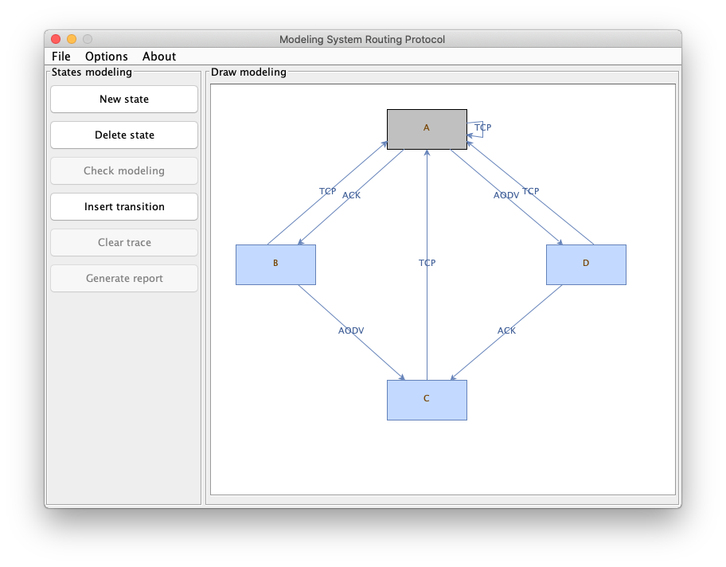

# Ferramenta MSRP

Pesquisa e desenvolvimento de uma ferramenta para automatização do processo de verificação de implementação de protocolo de rede.

## 🚀 Descrição

MSRP (Modeling System | Routing Protocol)
A ferramenta MSRP possibilita verificar e validar simulações geradas pelo software *Network Simulator 2 (NS2)*, através da importação do arquivo de saída trace e a comparação entre o modelo gerado pela MSRP. Também é possível importar um modelo pré-definido, com todos estados e eventos esperados no formato XML.

### 🖥 Execução da ferramenta

###### Como usar a MSRP
 
1. Modele uma máquina de estados graficamente usando os botões da interface: *New state*, *Delete state* e *Insert transition*
 - ou, basta carregar um modelo pré-definido em formato XML através do menu: *File* > *Open XML*.

2. Para verificar uma simulação, com o modelo gráfico já importado ou definido graficamente: 
 - acesse o menu: *File* e importe o arquivo trace clicando em *Import trace*
 - clique em *Check modeling*.

 ### ⚙️ Arquivos para execução MSRP

 - [Arquivo compilado MSRP para download](/Executable-and-files-MSRP/MSRP.jar.zip)
 - [Arquivo trace de exemplo](/Executable-and-files-MSRP/Trace%20File/)
 - [Arquivo de modelo gráfico em XML](/Executable-and-files-MSRP/XML%20Final%20State%20Machine/)

 ### 📚 Trabalhos relacionados

 [Artigos e trabalhos relacionados](/Related-works) que contribuiram para a pesquisa e desenvolvimento do trabalho [Verificação de Implementação de Protocolo de Rede Por Meio de Teste Baseado em Modelo](/Verifica%C3%A7%C3%A3o-de-Implementa%C3%A7%C3%A3o-de-Protocolo-de-Rede-por-Meio-de-Teste-Baseado-em-Modelo.pdf).

---
[Linkedin](https://www.linkedin.com/in/wellitonfernandes/) 😊